# 智能作业识别与错题管理系统 Readme

## 1. 项目概述

本项目是一个基于 Python 和 Gradio 构建的智能作业识别与错题管理系统。它旨在帮助学生和教师高效地处理纸质作业，自动识别错题，并提供错题管理、查询、导出以及同类题生成等功能，从而辅助个性化学习和教学。系统利用了多模态 AI 模型进行图像识别和分析，并将数据结构化存储在 SQLite 数据库中。

## 2. 主要功能

系统包含以下核心功能：

-   **首页仪表盘:**
    -   展示系统状态、错题总数、处理作业数等关键统计信息。
    -   显示学科分布、难度分布等图表化统计。
    -   预览最近添加的错题。
-   **作业上传与识别:**
    -   支持**图片上传**：用户可以上传作业图片（支持多张），系统会自动调用 AI 模型进行识别。
        -   OCR 识别题目文本。
        -   识别手写答案和笔记（区分颜色）。
        -   自动判断题目类型（选择、填空、判断、问答）。
        -   初步评估题目难度。
        -   识别结果预览。
        -   将识别出的错题自动存入数据库。
    -   支持**手动录入**：用户可以手动输入错题的详细信息（题目、学科、题型、难度、答案、解析等）。
    -   支持**批量导入**：提供生成示例数据的功能，便于快速填充和测试。
-   **错题查询与管理:**
    -   多维度**筛选查询**：按学科、题型、难度、时间范围等条件检索错题。
    -   **结果展示**：以表格形式清晰展示查询结果。
    -   **错题详情查看与编辑**：点击列表中的题目可查看完整信息，并支持在线编辑修改。
    -   **删除错题**：支持单条删除错题记录。
    -   **结果导出**：支持将查询结果或选中的错题导出为 Word 或 PDF 文件，可选择仅导出题目或包含答案解析。
-   **同类题生成:**
    -   根据已有的错题，**智能生成**相似题目。
    -   用户可以选择源错题，并指定生成数量（1-5题）。
    -   生成结果包含题目、答案和解析。
    -   支持**保存**生成的题目到数据库。
    -   支持将生成的题目或答案**导出**为 Word 文档。
-   **数据统计:** (集成在首页)
    -   提供错题总数、学科分布、难度分布等统计信息。

### 使用流程图 (Mermaid)

```mermaid
graph LR
    A[启动应用] --> B{首页}
    B --> C[查看统计数据]
    B --> D[作业上传]
    B --> E[错题查询]
    B --> F[同类题生成]

    subgraph 作业上传流程
        D --> D1{选择方式}
        D1 -- 图片上传 --> D2[选择图片/拍照]
        D1 -- 手动录入 --> D3[填写表单]
        D1 -- 批量导入 --> D4[生成/导入文件]
        D2 --> D5[选择学科] --> D6[开始处理]
        D3 --> D7[保存错题]
        D4 --> D8[生成/导入]
        D6 --> D9[AI识别(OCR/分类)] --> D10[结果预览] --> D11[数据入库]
        D7 --> D11
        D8 --> D11
        D11 --> B
    end

    subgraph 错题查询流程
        E --> E1[进入查询页面] --> E2[设置筛选条件]
        E2 --> E3[执行查询] --> E4[查看列表]
        E4 -- 点击题目 --> E5{错题详情}
        E5 --> E6[编辑模式] --> E7[保存修改] --> E4
        E5 --> E8[直接删除] --> E4
        E4 -- 选择题目 --> E9[导出选中] --> E10[下载文件]
        E9 --> B
        E10 --> B
    end

    subgraph 同类题生成流程
        F --> F1[进入生成页面] --> F2[查询错题]
        F2 --> F3[选择源错题]
        F3 --> F4[设置生成数量] --> F5[生成同类题]
        F5 --> F6[结果预览(表格)]
        F6 --> F7[保存生成结果] --> F8[数据入库]
        F6 --> F9[导出题目/答案] --> F10[下载文件]
        F7 --> B
        F9 --> B
        F10 --> B
    end

    C --> B
```

## 3. 项目特点

-   **智能化**：利用 AI 大模型进行图像识别、题目分析和同类题生成。
-   **多模态处理**：能够处理包含印刷体、手写体、公式和图表的作业图片。
-   **结构化存储**：将识别和录入的错题信息规范化存储在数据库中，便于管理和查询。
-   **用户友好**：采用 Gradio 构建 Web 界面，操作直观简单。
-   **模块化设计**：代码结构清晰，分为 UI、应用逻辑、核心模块等，易于维护和扩展。
-   **可配置性**：通过 `config.ini` 文件配置 API 密钥、模型名称、代理等参数。
-   **数据导出**：支持将错题和生成的题目导出为常用文档格式。

## 4. 项目结构

项目采用模块化的结构，主要目录和文件说明如下：

```mermaid
graph TD
    A[book_practice] --> B(app)
    A --> C(ui)
    A --> D(modules)
    A --> E(models)
    A --> F(data)
    A --> G(results)
    A --> H(exports)
    A --> I(resources)
    A --> J(summary3)
    A --> K(config.ini)
    A --> L(requirements.txt)
    A --> M(README.md)
    A --> N(需求.md)
    A --> O(同类题生成需求.md)

    B --> B1(main.py)
    B --> B2(config.py)

    C --> C1(pages)
    C1 --> C1a(home_page.py)
    C1 --> C1b(upload_page.py)
    C1 --> C1c(search_page.py)
    C1 --> C1d(similar_page.py)

    D --> D1(ai_generator)
    D1 --> D1a(question_generator.py)
    D --> D2(image_processing)
    D2 --> D2a(image_processor.py)
    D2 --> D2b(api_client.py)
    D2 --> D2c(color_analysis.py)
    D2 --> D2d(document_segmentation.py)
    D2 --> D2e(result_formatter.py)
    D --> D3(storage)
    D3 --> D3a(database.py)
    D3 --> D3b(feishu_sync.py)

    E --> E1(database_models.py)
    E --> E2(create_tables.sql)

    F --> F1(homework.db)
    I --> I1(...)
    J --> J1(readme_all.md)
    J --> J2(structure.mermaid)
    J --> J3(flowchart.mermaid)
    J --> J4(architecture.drawio.xml)

    subgraph 主要代码
        B
        C
        D
        E
    end

    subgraph 数据与资源
        F
        G
        H
        I
    end

    subgraph 配置与文档
        J
        K
        L
        M
        N
        O
    end
```



-   **`app/`**: 应用主逻辑和配置。
    -   `main.py`: Gradio 应用的入口文件，负责构建 UI 和启动服务。
    -   `config.py`: 定义项目常量配置（目前部分配置移至 `config.ini`）。
-   **`ui/`**: 用户界面相关代码。
    -   `pages/`: 包含各个功能页面的 Gradio UI 构建代码（首页、上传、查询、生成）。
-   **`modules/`**: 核心功能模块。
    -   `ai_generator/`: AI 同类题生成模块。
    -   `image_processing/`: 图像处理和 AI 识别模块。
    -   `storage/`: 数据存储模块（数据库交互、飞书同步）。
-   **`models/`**: 数据模型和数据库结构定义。
    -   `database_models.py`: SQLAlchemy 数据模型定义。
    -   `create_tables.sql`: (可选) 数据库表结构的 SQL 定义。
-   **`data/`**: 存储 SQLite 数据库文件 (`homework.db`)。
-   **`results/`**: 存储图像处理后生成的 JSON 结果文件。
-   **`exports/`**: 存储导出的 Word 或 PDF 文件。
-   **`resources/`**: 存放示例图片等资源文件。
-   **`summary3/`**: 存放本文档及相关图表。
-   **`config.ini`**: 外部配置文件，用于设置 API 密钥、模型名称、代理等。
-   **`requirements.txt`**: 项目依赖库列表。
-   **`README.md`**: 简要的项目说明。
-   **`需求.md`, `同类题生成需求.md`**: 项目需求文档。

## 5. 技术栈

-   **后端框架**: Python
-   **Web UI**: Gradio
-   **数据库**: SQLite (通过 SQLAlchemy 操作)
-   **AI 模型接口**: OpenAI SDK (用于调用 Gitee AI 或 OpenRouter 提供的模型)
    -   图像识别: Qwen2.5-VL-32B-Instruct / Gemini-2.5-Pro 等多模态模型
    -   文本处理/问答: QwQ-32B / 其他 GPT 类模型
    -   同类题生成: GPT-3.5/4 或类似模型
-   **图像处理**: OpenCV, Pillow
-   **数据处理**: Pandas, NumPy
-   **文件导出**: python-docx (Word), ReportLab (PDF)

## 6. 架构设计

系统采用分层架构，如下图所示：

```xml
<!-- architecture.drawio.xml 内容嵌入 -->
<!-- 由于 Markdown 不直接支持嵌入 Draw.io XML，这里仅作示意 -->
<!-- 建议在支持 Draw.io 插件的平台或工具中查看 architecture.drawio.xml 文件 -->

[查看架构图 (architecture.drawio.xml)](architecture.drawio.xml)
```

**架构图说明:**

1.  **用户界面 (Gradio)**: 用户与系统交互的入口，负责展示信息和接收用户操作。
2.  **应用逻辑 (app/main.py)**: 作为 UI 和后端模块的协调者，处理用户请求，调用相应的功能模块。
3.  **核心模块 (modules)**: 实现系统的核心业务逻辑。
    -   **图像处理 (image_processing)**: 负责图像的预处理、调用 AI API 进行识别和分析、格式化结果。
    -   **AI 生成器 (ai_generator)**: 调用 AI API 生成同类题目。
    -   **数据存储 (storage)**: 封装数据库操作，提供数据的增删改查接口。
4.  **外部服务与数据存储**:
    -   **AI API (Gitee/OpenRouter)**: 提供图像识别、文本生成等 AI 能力。
    -   **数据库 (SQLite)**: 持久化存储错题和生成的同类题数据。

数据流：用户通过 UI 操作 -> 应用逻辑接收请求 -> 调用核心模块 -> 核心模块可能调用 AI API 或访问数据库 -> 结果返回给应用逻辑 -> 更新 UI 显示给用户。

## 7. 使用说明

1.  **环境准备**:
    -   确保已安装 Python (推荐 3.9+)。
    -   安装项目依赖：`pip install -r requirements.txt`。
2.  **配置**:
    -   复制 `config.ini.template` (如果存在) 为 `config.ini`。
    -   在 `config.ini` 文件中填入必要的 API 密钥（如 Gitee AI 或 OpenRouter 的 Key）。
    -   根据需要配置代理 (`[PROXY]` 部分)。
3.  **运行**:
    -   在项目根目录下运行主程序：`python app/main.py`。
    -   系统会尝试在 7860 端口启动，如果端口被占用，会自动尝试 7861-7866。
    -   启动成功后，在浏览器中打开显示的 URL (通常是 `http://0.0.0.0:7860` 或 `http://127.0.0.1:7860`)。
4.  **操作**:
    -   **首页**: 查看系统概览和统计数据。
    -   **作业上传**:
        -   *图片上传*：选择"图片上传"标签页，选择学科，点击"上传作业图片"或双击"题库案例"中的图片，然后点击"开始处理"。处理完成后会在"处理状态"和"预览"区域显示结果。识别出的错题会自动保存。
        -   *手动录入*：选择"手动录入"标签页，填写错题信息，点击"保存错题"。
        -   *批量导入*：选择"批量导入"标签页，可使用"生成示例错题"功能快速添加数据。
    -   **错题查询**:
        -   选择"错题查询"标签页。
        -   设置筛选条件（学科、题型、难度、时间），点击"查询"。
        -   在表格中查看结果。点击某行可查看详情、编辑或删除。
        -   勾选需要导出的题目，选择导出格式，点击"导出选中题目"。
    -   **同类题生成**:
        -   选择"同类题生成"标签页。
        -   设置筛选条件，点击"查询错题"找到源题目。
        -   在"错题列表"表格中点击选择一个源题目。
        -   设置"生成数量"。
        -   点击"生成同类题"。
        -   在"生成结果"表格中预览生成的题目。
        -   点击"保存生成结果"将题目存入数据库。
        -   点击"导出题目"或"导出答案"生成 Word 文档并下载。

## 8. 配置说明 (`config.ini`)

`config.ini` 文件用于管理外部服务的配置信息，主要包含：

-   **`[gitee]` / `[302AI]` / `[OpenRouter]` 等**: 不同 AI 服务提供商的配置。
    -   `base_url`: API 的基础 URL。
    -   `api_key`: 你的 API 密钥。
    -   `model`: 要使用的模型名称。
    -   `max_tokens`, `temperature`, `top_p`, `top_k`: 模型调用参数。
-   **`[PROXY]`**: 网络代理配置。
    -   `enable_proxy`: 是否启用代理 (true/false)。
    -   `http_proxy`: HTTP 代理地址 (例如 `http://127.0.0.1:7890`)。
    -   `https_proxy`: HTTPS 代理地址 (例如 `http://127.0.0.1:7890`)。

**注意**: 请妥善保管你的 API 密钥，不要将其公开或提交到版本控制系统。建议将 `config.ini` 文件添加到 `.gitignore` 中。

## 9. 运行说明

如"使用说明"第 3 点所述，通过运行 `python app/main.py` 启动应用。确保运行前已完成环境准备和配置。日志信息会输出到控制台，有助于了解系统运行状态和排查问题。 